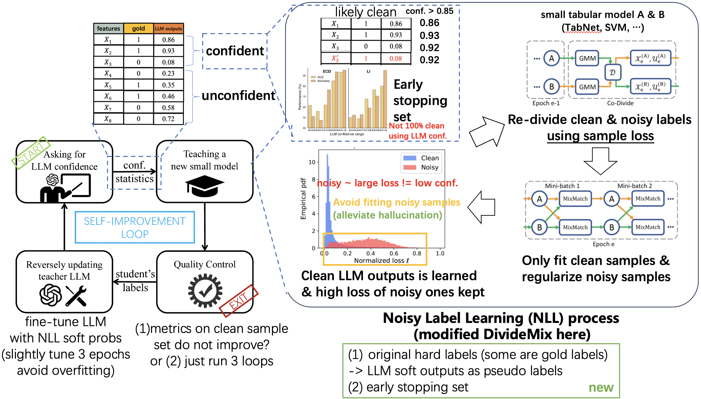
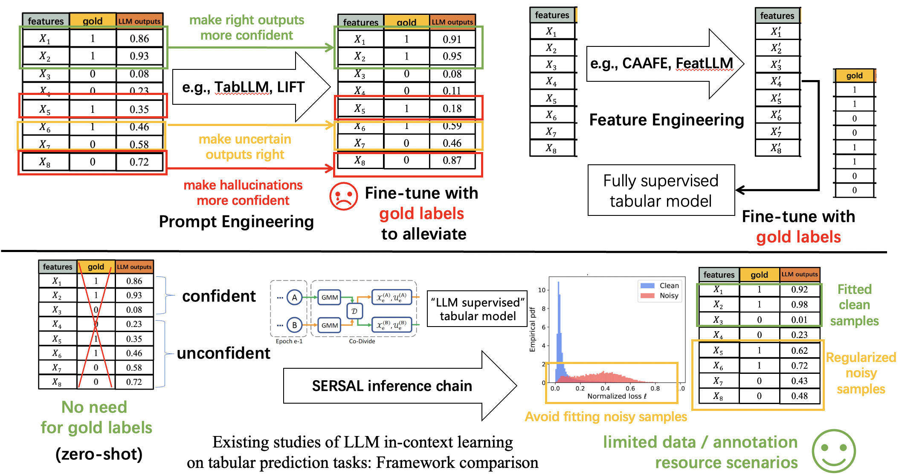

# For NeurIPS24' Anonymous Rebuttal (Submission ID: 18443)

### How to understand the fundamental improvement achieved by SERSAL

  
    <figcaption style="text-align: center;">In-depth view of SERSAL mechanism.</figcaption>

Here we provide detailed illustration of SERSAL pipeline, essentially SERSAL is a fundamentally new inference chain specifically designed to adapt LLM zero-shot reasoning capability to tabular prediction tasks, in the above framework, all components (LLM, small tabular model, noisy label learning algorithm) can be substituted according to practical usage. Principally, SERSAL is an innovative combination of LLM reasoning and noisy label learning, by reformulating learning from LLM outputs as learning from noisy labels. **The key mechanism here is to let the small tabular model solely learn from clean LLM outputs, while the remaining noisy samples are used for regularization, which avoids to be overfitted or misled by wrong LLM outputs while leveraging all samples.** The SERSAL loop is introduced for further refining the LLM outputs, forming a self-improvement mechanism for LLMs on zero-shot tabular prediction.

### Comparison with other LLM in-context learning studies on tabular prediction

  
    <figcaption style="text-align: center;">Framework comparison.</figcaption>

To our knowledge, current LLM in-context learning studies on tabular prediction are primarily **relying on the data scenarios where gold labels are accessible for fine-tuning LLMs or small tabular models**. Our SERSAL is rooted in a totaly different data scenarios **with no gold labels accessible, or more practically, the domains where annoations are costly or inadequate data exists, which points out a clear uniqueness** that existing prompt engineering or feature enginnering methods require sufficent data with gold labels to work, and our SERSAL contributes to the scenarios of limited data / annotation resource like tabular prediction in medical domain (In the paper, we also disscuss the generalized adaptability of SERSAL to other general domains, see Table 5).

